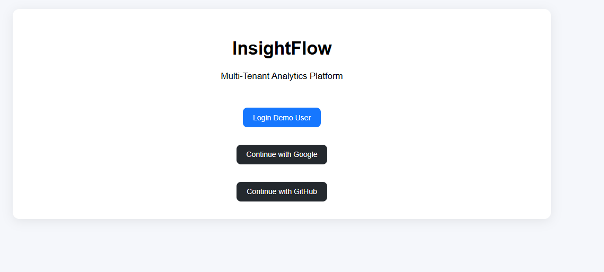
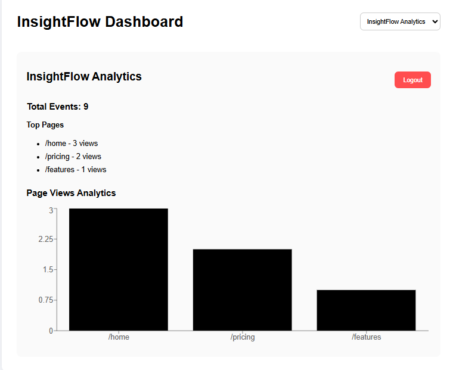
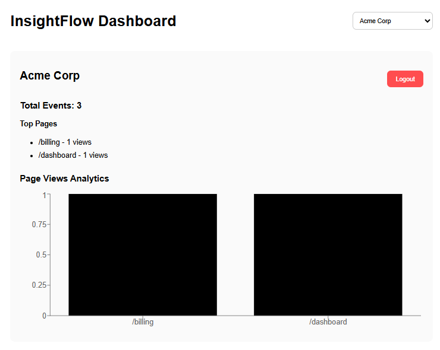
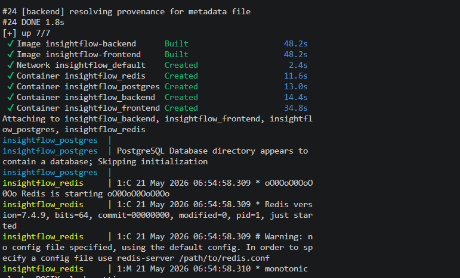

# InsightFlow

InsightFlow is a full-stack multi-tenant analytics dashboard built using Django, React, PostgreSQL, Redis, and Docker.

The project demonstrates how modern SaaS applications handle:
- workspace-based multi-tenancy
- analytics event tracking
- dashboard aggregation
- Redis caching
- protected frontend routes
- scalable frontend/backend communication
- containerized infrastructure

This project was built as a production-style SaaS analytics platform inspired by tools like Mixpanel, PostHog, and Plausible.

---

# Features

## Authentication
- OAuth-ready authentication flow
- Protected frontend routes
- Login state management using React Context

## Multi-Tenancy
- Workspace-based tenant isolation
- Workspace-specific analytics
- Dynamic workspace switching
- Tenant-aware API architecture

## Analytics Dashboard
- Total event tracking
- Top pages aggregation
- Workspace analytics visualization
- Time-series-ready architecture

## Backend Features
- Django REST Framework APIs
- PostgreSQL relational modeling
- Redis caching integration
- Optimized aggregation queries
- Workspace membership permissions

## Frontend Features
- React Router protected routes
- React Query server-state management
- Axios API integration
- Recharts analytics visualization
- Reusable component structure

## Infrastructure
- Dockerized backend
- Dockerized frontend
- PostgreSQL container
- Redis container
- Docker Compose orchestration

---

# Tech Stack

## Backend
- Django
- Django REST Framework
- PostgreSQL
- Redis
- django-redis

## Frontend
- React
- React Router
- React Query
- Axios
- Recharts
- Vite

## DevOps
- Docker
- Docker Compose

---

# System Architecture

The application follows a modern full-stack SaaS architecture:

Frontend (React SPA)
↓
Django REST API
↓
PostgreSQL + Redis

### Architecture Flow

- React handles the user interface and routing
- Django REST Framework exposes API endpoints
- PostgreSQL stores workspace and analytics data
- Redis caches expensive analytics queries
- Docker manages the entire application stack

---

# Screenshots

## Login Page



---

## InsightFlow Workspace Dashboard



---

## Acme Workspace Dashboard



---

## Docker Containers Running



---

# Multi-Tenant Architecture

Each workspace acts as an isolated tenant.

All analytics events are associated with a specific workspace, ensuring tenant-level data isolation.

Workspace-specific API endpoints:

```bash
GET /api/w/<workspace_slug>/dashboard/summary/
````

The frontend dynamically switches workspaces and automatically reloads analytics data using React Query query keys.

---

# Redis Caching

Dashboard summary responses are cached using Redis.

### Cache Strategy

* Cache key is workspace-specific
* Expensive aggregation queries are cached
* Cached summaries reduce database load
* Cache timeout is set to 15 minutes

Example cache key:

```bash
workspaces:{workspace_id}:dashboard_summary
```

---

# Analytics Features

The dashboard visualizes:

* total events
* top pages
* page view analytics
* workspace-specific activity

Charts are implemented using Recharts.

---

# Dockerized Infrastructure

The project uses Docker Compose to orchestrate:

* frontend container
* backend container
* PostgreSQL container
* Redis container

This provides:

* isolated development environments
* reproducible builds
* simplified setup process

---

# Project Structure

```bash
insightflow/
│
├── backend/
├── frontend/
├── screenshots/
├── docker-compose.yml
├── .env.example
├── README.md
```

---

# Environment Variables

Example `.env` configuration:

```env
DEBUG=True

SECRET_KEY=your-secret-key

POSTGRES_DB=insightflow_db
POSTGRES_USER=postgres
POSTGRES_PASSWORD=postgres
POSTGRES_HOST=postgres
POSTGRES_PORT=5432

REDIS_URL=redis://redis:6379/1
```

---

# Installation and Setup

## Clone Repository

```bash
git clone https://github.com/ashifa-1/insightflow
cd insightflow
```

---

## Start Application

```bash
docker-compose up --build
```

---

## Backend URL

```bash
http://localhost:8000
```

---

## Frontend URL

```bash
http://localhost:5173
```

---

# Running Migrations

```bash
docker-compose exec backend python manage.py migrate
```

---

# Create Superuser

```bash
docker-compose exec backend python manage.py createsuperuser
```

---

# Access Django Admin

```bash
http://localhost:8000/admin
```

---

# API Endpoints

## Dashboard Summary

```bash
GET /api/w/<workspace_slug>/dashboard/summary/
```

---

## OAuth Simulation Endpoints

```bash
GET /api/auth/google/
GET /api/auth/github/
```

---

# Outcome

InsightFlow demonstrates a scalable multi-tenant analytics platform using modern full-stack technologies and production-style infrastructure patterns.

The project combines backend engineering, frontend architecture, caching strategies, analytics visualization, and containerized infrastructure into a complete SaaS-style application.